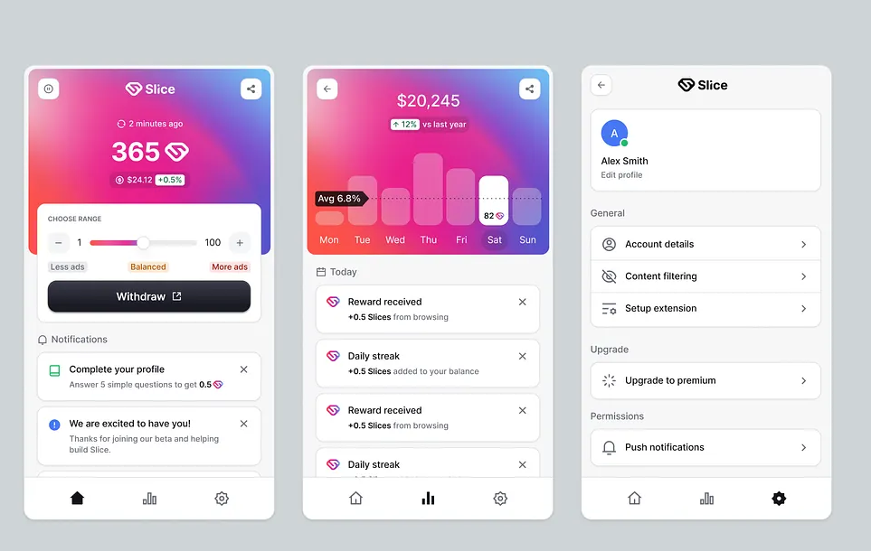

# Koolpals Tracker Design System

Version 1 · September 27, 2026

**User direction:** predominantly white, with charcoal/black and selective red accents. Red gradients should be subtle decoration, not large saturated surfaces.

Use this guide and `styles/tokens.css` for future tracker UI work. The visual reference was supplied by the user; it establishes layout and component direction. Brand colors come from Koolpals, with additional shades chosen for this extension.

## Reference analysis

The reference uses a light, compact extension shell with a vivid branded header, white cards, restrained shadows, and fine neutral borders. A white summary/action card overlaps the colored header. Large numbers establish hierarchy; small labels and line icons keep supporting information quiet. Controls use moderate corner rounding rather than oversized pills. Primary actions are charcoal with a slight top highlight. Settings appear as simple grouped rows, with an icon, label, and trailing control.

Its three screens share consistent spacing, typography, and bottom navigation. The navigation reflects real destinations, and each selected destination has a clear active state. The tracker uses three fixed bottom tabs: Home (watched summary and episode browsing), Favorites (saved episodes), and Settings (sync, backup, and cleanup). Keep only the active screen visible, with independent content scrolling above the navigation. Support arrow keys, Home, and End to navigate tabs. Do not invent analytics, charts, or placeholder destinations to reproduce the screenshot.

## Color provenance

The public [Koolpals website](https://thekoolpals.com/) declares `#FC0303` in its theme-color metadata and card background, black for card text, light gray `rgb(246, 246, 246)` surfaces, and `#1A1A1A` shadow accents. The repository logo also uses red, black, and white. These observations are not an official comprehensive brand manual.

| Role | Token | Value | Usage |
| --- | --- | --- | --- |
| Brand red | `--kp-brand` | `#FC0303` | Decorative header accents; avoid small white text directly over it |
| Strong red | `--kp-brand-strong` | `#C5091B` | Active switches, favorite icons, links; derived accessible shade |
| Deep red | `--kp-brand-deep` | `#980C22` | Header behind white labels, selected video favorites; derived shade |
| Pale red | `--kp-brand-soft` | `#FFF0F0` | Icon tile fills; derived shade |
| Canvas | `--kp-canvas` | `#F6F6F6` | Popup and library backgrounds |
| Surface | `--kp-surface` | `#FFFFFF` | Cards and settings groups |
| Main text | `--kp-text` | `#1A1A1A` | Titles, labels, primary content |
| Secondary text | `--kp-muted` | `#61616B` | Captions; derived neutral |
| Card border | `--kp-border` | `#DEDEE3` | Decorative separators and card outlines |
| Control border | `--kp-control-border` | `#888891` | Interactive outlines that need stronger contrast |
| Success | `--kp-success` | `#187448` | Watched confirmation; semantic, not a brand color |
| Error | `--kp-error` | `#A31325` | Error text paired with an explicit message |

The white-to-blush header treatment and red top accent are extension-specific interpretations of the reference, not gradients copied from Koolpals. The user prefers a predominantly white interface, so reserve stronger gradients for small accents. Primary calls to action use a charcoal gradient with white text; red identifies brand and selection rather than every button.

## Foundations

- **Typography:** bundled system sans-serif stack; no remote font request. Titles 22px, section headings 16–18px, body 14px, component labels 12–13px, captions 11px. Use 600–750 weights for hierarchy and 1.4–1.6 body line height. Reserve 9px uppercase text for nonessential decorative eyebrows only.
- **Spacing:** 4px base scale: 4, 8, 12, 16, 20, 24px. Use 12–16px inside cards and 16–24px between sections.
- **Shape:** 8px controls, 12px cards, 16px large panels. Video controls may use pills to sit comfortably beside YouTube controls.
- **Elevation:** thin borders plus a subtle shadow for cards; use the raised shadow only for a card overlapping the hero. No large glows or thick outlines.
- **Size:** popup 380px, usable at 320px; library expands to 620px. Wrap long episode titles. Scroll long lists instead of letting the popup grow indefinitely.
- **Motion:** short 120ms color transitions only; respect reduced-motion preferences. No animated logo or decorative loops.

## Components and states

### Brand hero and summary

Use a compact white brand bar shared by all tabs. Home has a centered watched count on a subtle red/blush gradient, with a white action card overlapping the lower edge. A single favorites shortcut sits below it. Favorites and Settings have simple headings and spacious rows; do not repeat the hero or counts on every screen. Keep sync controls in Settings. The popup is 560px tall with a fixed 64px bottom navigation and one scrolling content area.

### Episode card

Use a white bordered row with a pale-red play tile, full episode title, small “Watch on YouTube” label, and a trailing favorite toggle. The title/play area opens the video. The star removes a favorite and needs an explicit accessible name. Avoid remotely fetched thumbnails unless a future requirement justifies the extra requests and privacy change.

### Buttons and selection

- **Primary:** charcoal fill, white label, subtle inset highlight; one main action per section.
- **Secondary:** white fill, neutral control border; management and supporting actions.
- **Icon/ghost:** at least 44px target, visible hover fill, accessible label and tooltip.
- **Watched:** green tint plus a check and “Watched” label.
- **Favorited:** brand red plus a filled star and “Favorited” label. Never communicate selection through color alone.
- **Busy/disabled:** disable duplicate operations, retain readable labels, expose busy status where applicable.
- **Error:** explicit text in a pale error card. Preserve failed actions for retry rather than showing false success.

### Sync and settings

Use a white grouped settings card. A row contains a line icon, visible label, secondary state text, and a trailing switch with a 44px target. Keep the explanation short. A local enabled switch does not prove remote delivery: use “Enabled for this browser,” not “Synced successfully.”

### Video controls

Share the tokens and `TrackerIcon` component. Neutral controls remain charcoal with white text for contrast over video. Green indicates watched; red indicates favorite. Use opaque fills and 44px targets. Place YouTube controls at the right of the title, outside the clamped heading. Allow the controls to wrap to a right-aligned row when space is limited. On the Koolpals site, place embed controls in a separate row above the player wrapper so they never cover the video. Standalone YouTube embeds hide in-player controls during playback. Keep the rest of the overlay transparent to pointer events. Check subtitles, fullscreen, and narrow players when placement changes.

## Implementation and review

Tokens are scoped to `.tracker-app` and `.kp-tracker-overlay`; never theme a host page's `:root`, headings, or buttons from a content-script stylesheet. Use `kp-` names for injected UI and explicit pixel font sizes because YouTube's root font sizing differs from the popup.

Reuse existing state and storage helpers. Styling must not add metadata requests, change watched/favorite semantics, or imply browser-sync delivery. Add a token before introducing a recurring new visual value; contextual player surfaces may retain documented dark overrides.

Before delivery, inspect populated and empty states, selected/unselected controls, disabled/error states, long titles, keyboard focus, and narrow layouts. Check text contrast (4.5:1 for normal text) and meaningful control outlines (3:1). Test 200% zoom. Run TypeScript and browser builds. Clearly distinguish a mocked component preview from a live extension check.
